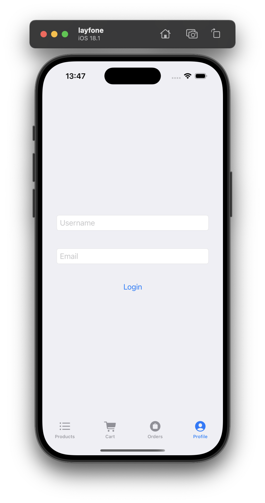

# Supermarket App


This app was a playground for me to learn SwiftUI, Combine, and SwiftData. In the mean time apply the principles of SOLID and the VIPER architecture.
It's a Supermarket app based on the API from Valentin Despa documented here 
https://github.com/vdespa/Postman-Complete-Guide-API-Testing/blob/main/simple-grocery-store-api.md


## Table of Contents

1. [API Status Screen](#APIStatus) 
2. [Product List Screen](#ProductList)  
3. [Product Detail](#ProductDetail)  
4. [Signup/Profile](#signup-profile)
5. [Add to cart](#Add-to-cart)
6. [Cart](#Cart)
7. [Orders](#Orders)


  <h2 id="APIStatus">API Status Screen</h2>
  The First Screen the user sees is the APIStatus Screen, In this screen we call the  <a href="https://simple-grocery-store-api.glitch.me/status">/status endpoint</a> and we expect a Status of "UP".
  After that the user is redirected to product listing or an Error screen is shown.
  

  <h2 id="ProductList">Product List Screen</h2>
  The First Screen the user sees is the APIStatus Screen, In this screen we call the /status endpoint and we expect a Status of "UP".
  After that the user is redirected to product listing or an Error screen is shown.

   

  The first time we show the product listing we call the presenter via the interactor calls the <a href="https://simple-grocery-store-api.glitch.me/products/">/products endpoint</a> which lists products like the following format

  ```json
[
   {
      "id":4643,
      "category":"coffee",
      "name":"Starbucks Coffee Variety Pack, 100% Arabica",
      "inStock":true
   },
   {
      "id":4646,
      "category":"coffee",
      "name":"Ethical Bean Medium Dark Roast, Espresso",
      "inStock":true
   }
]
  ```
  Which is incomplete information about products that's why for each product we call the <a href="https://simple-grocery-store-api.glitch.me/products/4643">Product detail endpoint</a> for each product so that we get the full information which is the following format

  ```json
 {
   "id":4643,
   "category":"coffee",
   "name":"Starbucks Coffee Variety Pack, 100% Arabica",
   "manufacturer":"Starbucks",
   "price":40.91,
   "current-stock":14,
   "inStock":true
}
  ```
  Than after that we end up with a list of full detailed products which is persisted Thanks to SwiftData so that other times we don't need to call the API.

  When the user logs in a cart button is shown in the product cells.

  
  
<h2 id="ProductDetail">Product Detail</h2>
 The user is routed to product detail screen (which is beautifuly designed 😂) after clicking on a product in the product list view.
 If the product is unavailable the cart button will be disabled. And same for the list view if the user is not logged in, the cart button wont be shown. 
 The presenter will prompt the interactor for the product detail which tries to retrieve the product detail from database first then if it's not available the <a href="https://simple-grocery-store-api.glitch.me/products/4643">Product detail endpoint</a> is called.
 

 <div style="display: flex; justify-content: space-around;">
  
  
</div>

<h2 id="signup-profile">Signup/Profile Screen</h2>

To signup the user needs to fill their email and username and hit login button.

<div style="display: flex; justify-content: space-around;">
  
  
</div>

The <a href="https://simple-grocery-store-api.glitch.me/api-clients">/api-clients endpoint</a> with `POST` Method and the following body

```json
{
   "clientName": "Mohcine2311",
   "clientEmail": "Mohcine2311@gmail.com"
}
```

Then after receiving a successful response the user is logged in, the user's name, email and `accessToken` are persisted.
Being logged in after that would mean that we can retrieve those 3 elements.


<h2 id="Add-to-cart">Add To Cart</h2>
Once the user is logged, they can add products to their cart by clicking on the cart button. An add to cartview is shown with quantity stepper

<div style="display: flex; justify-content: space-around;">
  
  
</div>

By clicking Add to cart, a `POST` request is sent to the <a href="https://simple-grocery-store-api.glitch.me/carts/:cartId/items"> /carts/:cartId/items endpoint</a> 

NB: The request needs to be authenticated using the bearer token.

```json
{
   "productId": 1234,
   "quantity": 2
}
```

When the Product is added to the cart the quantity is reflected on the cart button and total products in the cart is shown in the CartTab Badge

<div style="display: flex; justify-content: space-around;">
  
  
</div>

The user can edit the quanitity of the product by pressing again on the cart button, setting the quantity to 0 will remove the product.

<div style="display: flex; justify-content: space-around;">
  
  
</div>

The same endpoint for adding the product is called for those 2 previous requests except that the method for editing the quantity is `PATCH` and to remove is `DELETE`.

<h2 id="Cart">Cart</h2>

If the User is not logged or the cart is empty a button is show to redirect to the right screen.
<div style="display: flex; justify-content: space-around;">
  
  
</div>

To get the cart we call the <a href="https://simple-grocery-store-api.glitch.me/carts/:cartId/items"> /carts/:cartId/items endpoint</a> with a `GET` method and bearer token in the Authentication header.

The typical Response looks like the following.
```json
[
    {
        "id": 511308211,
        "productId": 8554,
        "quantity": 3
    },
    {
        "id": 909804652,
        "productId": 5774,
        "quantity": 1
    }
]
```

Which doesn't contain enough information that's why we cross data from stored products in the database to get product detail for each cartItem and we end up with an object like this

```swift
@Model
class CartItemPresentationModel: Identifiable {
    var id: Int
    var productId: Int
    var quantity: Int
    var product: ProductDetailPresentationModel
    
    init(id: Int, productId: Int, quantity: Int, product: ProductDetailPresentationModel) {
        self.id = id
        self.productId = productId
        self.quantity = quantity
        self.product = product
    }
    
    var totalPrice: Double {
        Double(quantity) * product.price
    }
    
    var totalFormattedPrice: String {
        return totalPrice.formattedPrice
    }
    
    var detailledPrice: String {
        return "(\(quantity) x \(product.price.formattedPrice))"
    }
    
}
```

Now we have enough information to show total price for each product which is the product price multiplied by the quantity and then a total price for the whole cart.


The user sees the products that can be edited removed by clicking on the cart button.

The Order items button give the possibility to the user to make the order with the cart items which will call the <a href="https://simple-grocery-store-api.glitch.me/orders"> /orders endpoint</a>  with a `POST` method with the following body.

Then the cart is cleared from memory and from Database.

```json

{
    "cartId": "d1wZBGklDG4jdfBW6mjAL",
    "customerName": "Mohcine"
}

```

<h2 id="Orders">Orders</h2>

By Going to the Orders Screen we have the same logic for empty orders and not logged user as in the Cart Screen.

for showing orders we send a request to the /orders and we get a response in this format

```json
[
    {
        "id": "NH2ON0KLT3IDtDQfT4q-2",
        "items": [
            {
                "id": 57929473,
                "productId": 6483,
                "quantity": 1
            },
            {
                "id": 562827312,
                "productId": 4646,
                "quantity": 4
            },
            {
                "id": 865531897,
                "productId": 5774,
                "quantity": 1
            },
            {
                "id": 800532997,
                "productId": 4641,
                "quantity": 3
            }
        ],
        "customerName": "Mohcine",
        "created": "2024-11-25T13:41:02.854Z",
        "comment": ""
    }
]

```

The items are in the same format as cart items they don't contain enough information so it's better to map them to products that are stored in the database so that we can get enough information and create useful objects like the following:


```swift

@Model
class OrderItemPresentationModel {
    var orderId: String
    var items: [CartItemPresentationModel]
    var created: String
    
    
    init(orderId: String, items: [CartItemPresentationModel], created: String) {
        self.orderId = orderId
        self.items = items
        self.created = created
    }
}
```

Then we have enough information to show for example the total of the order

NB: the cells expand and retract when clicked to show the total amoun of the order like on the screeshots:

<div style="display: flex; justify-content: space-around;">
  
  
</div>


